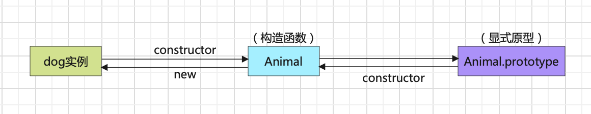

# JavaScript 之原型链浅析

> 原型的应用在 javaScript 中处处可以见到，例如：数组可以调用 split、concat、push 等方法，我们并没有在数组对象中去声明这些方法，那这些方法又从哪里来呢？这都已经在数组的原型对象上定义好了，在调用的时候会顺着原型链向上查找。

---

先给出几个结论，下面部分会以箭头函数来讲解原型链：

-   每个函数都具有一个 prototype 属性（箭头函数除外）,也称作显式原型
-   对象类型都具有可拓展的属性
-   每个对象类型都具有\_\_proto\_\_属性，也称作隐式原型
-   每个原型都有一个 constructor 指向与之相关联的构造函数
-   一个对象变量的隐式原型\_\_proto\_\_指向它的构造函数的显示原型 prototype

以下将基于此对象做讨论：

```js
function Animal(name) {
    this.name = name;
    this.run = function () {
        console.log(`${name} is running!`);
    };
}

const dog = new Animal('dog');
```

## prototype

每个函数都具有 prototype 这个属性，但是特别的是箭头函数并不具有这个特性，箭头函数作为一种“纯净版”的函数，在 ES6 规范中定义的时候就移除了 this 指针、arguments、prototype 等属性，也不能被 new 出来创建实例。

## \_\_proto\_\_

而每个对象类型都具有\_\_proto\_\_属性，通俗易懂的理解，对象类型指的是都是由相应的构造函数实例化而来的。null 和 undefined 并没有对应的构造函数。对象类型介绍：https://www.w3school.com.cn/js/pro_js_object_types.asp 。对于箭头函数来讲，它也是一个对象类型，是由 Function 实例化而来的，所以也具有\_\_proto\_\_。

## constructor 属性

每个对象类型都有一个 constructor 指向与之关联的构造函数。但是在原型链的尽头，Object.prototype 的\_\_proto\_\_指向的是 null，所以并没有构造函数，也就没有 constructor 属性。

---



## 原型链基本构成

原型链的形成基于如下一条众所周知的规则：\
 实例的隐式原型\_\_proto\_\_会指向构造函数的 prototype，在寻找一个对象的属性的时候，比如说在 dog 这个对象中并没有定义 run()这个方法，这时候会按照原型链的规则去逐层向上寻找对应的属性，直至找到返回。

1. 由 prototype 的介绍可以知道，Animal 这个对象有一个显式原型属性。
2. 由\_\_proto\_\_的介绍可以知道，每个对象类型都有\_\_proto\_\_属性，那么 Animal 的显式原型 prototype 也是一个对象。
3. 这个 Animal 的显示原型对象的\_\_proto\_\_属性又指向对象类型的构造函数原型，也就是 Object。
4. 这种套娃式链路也得有一个终点，Object.\_\_proto\_\_就指向了 null。
5. Animal 这个构造函数也是有隐式原型的，函数都来源于 Function。

一张图更胜于繁琐的文字说明：


## 箭头函数不能作为构造函数的原因

箭头函数不能继承于 Object，因为它本身并不具备 prototype 属性，向构造函数这一方向的原型链就终止了，所以这就是箭头函数不能作为构造函数的原因。但他自己可以将\_\_proto\_\_属性指向 Function，去继承 Function 原型上的一些方法属性。

## Function 的显示原型和隐式原型

Function 算是一种本地对象，它原型的规定可能看上去无限套娃，但是易于读者去理解原型链。

> github 地址：https://github.com/RainyLiao/articles （欢迎提出意见和建议！）😄
