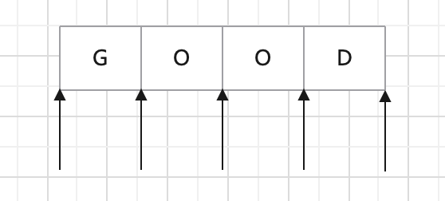

# JavaScript 之正则表达式

> 正则表达式大致可以从两种维度去进行字符串的匹配，一种是横向字符匹配，一种是纵向位置匹配。本文将从这两种匹配模式入手，系统性的进行正则表达式的讲解。

## 1、横向字符匹配

通俗的讲对一个字符串进行字符个数的匹配就是横向字符匹配。<br/>
通常使用 a{m,n}来表示对一个字符 a 匹配 m 到 n 次。<br/>
这里的{m,n}被称作量词，在横向模糊匹配中使用到频率最多的就是量词了，比如要对字符 a 匹配一次或多次，在这个时候就可以使用 a+来进行量词的表述。常用的量词表现形式如下表：
| 量词 | 描述 |
| ---- | ---- |
| a+ | 匹配任何包含至少一个 a 的字符串。 |
| a\* | 匹配任何包含零个或多个 a 的字符串。 |##
| a? | 匹配任何包含零个或一个 a 的字符串。 |

例如:<br/>

```js
let reg = /abc{1,3}de/; //表示匹配c这个字符一到三次
console.log(reg.test('abccde')); // return true
/***********************************************/
let reg = /abc*de/; //表示匹配c这个字符0次或多次
console.log(reg.test('abde')); // return true
```

## 2、纵向位置匹配

对于在一个位置上有多种可能情况的，就可以使用纵向位置匹配。<br/>
使用字符组[]代表某一个位置上的取值范围。<br/>
通常使用 a[b,c,d]来表示在 a 字符的后面可以连接上 b，c，d 三种情况,同时匹配到 ab，ac，ad 三种字符串。
例如：

```js
let reg = /a[1,2,3]b/; // 表示在第二个位置上有三种情况
let str = 'a1b a2b a3b';
console.log(str.match(reg)); // ['a1b', index: 0, input: 'a1b a2b a3b', groups: undefined]
```

可以发现匹配到得字符串就只有一个，这种情况是因为改正则表达式是惰性匹配，当匹配到一个结果的时候，就停止了。这时候需要在 reg 后面加上一个 g 修饰符来表示进行全局匹配。

```js
let reg = /a[1,2,3]b/g;
let str = 'a1b a2b a3b';
console.log(str.match(reg)); //['a1b', 'a2b', 'a3b']
```

常见的修饰符如下表：
| 修饰符 | 描述 |
| ---- | ---- |
| g | 表示全局匹配。 |
| i | 不区分大小写。 |
| m | 启用多行模式。 |

### 2.1 字符组的范围表示法

如果想要在某个位置上匹配 26 个字母，不区分大小写，生搬硬套的话需要将 52 个字符全部在字符组中一一列举出来。这样的话就太过于麻烦了，字符组的范围表示法就能很好的解决这个问题。可以使用[A-Za-z]来表示，范围表示遵循 ASCLL 码值的顺序。不能使用[A-z]一步到位，因为在 ASCLL 码表中英文大写字母和小写字母中还穿插了一些其他的字符。<br/>
当需要匹配连字符怎么办呢？我们可以使用[-az]或[az-]或[a\-z]来匹配字符 a、-、z，不要让字符组被认作一个范围表示就好了。

```js
let reg = /ab[-cd]e/;
console.log(reg.test('ab-e')); // return true
```

### 2.2 字符组的反向表示法

假设要匹配排除某个条件的字符，这时候可以用到^，例如^[0-9]，表示除了 0-9 之外的其他字符都符合条件。这时候就可以自然而然的明白元字符的概念了，它们都是正则表达式里预设，并具有一些特殊含义的字符。大写字母的元字符，都是它们的反模式。最基本的元字符如下表：
| 元字符 | 描述 | 等价于 |
| ---- | ---- | ---- |
| \w | 查找数字、字母及下划线。 | [0-9a-zA-Z_] |
| \d | 查找数字。 | [0-9] |
| \s | 查找空白字符。 | [\t\v\n\r\f] |
| . | 通配符。换行符、回车符、行分隔符和段分隔符除外。| [^\n\r\u2028\u2029] |

如果要匹配任意字符，可以使用[\d\D]、[\w\W]、[\s\S]和[^]中任何的一个。

### 2.3 正则的位置分析

对于在正则表达式的位置，我们可以理解为是每个字符前后的空白符。



es5 中有 6 中锚字符：

> ^ $ \b \B (?=p) (?!p)

#### 2.3.1 ^和$

^（脱字符）匹配开头，在多行匹配中匹配行开头。

$（美元符号）匹配结尾，在多行匹配中匹配行结尾。

```js
console.log('aaa'.replace(/^|$/g, 1))
init.js:1 1aaa1
```

这段 aaa 的字符串，开头和结尾的脱字符和美元符号替换为 1。

#### 2.3.2 \b 和 \B

\b 是单词边界，那怎么才能算作是一个单词呢？这里的单词指的是\w 和\W 之间的位置，也包括\w 和^之间的位置，也包括\w 和$之间的位置。
例如对一个磁盘路径进行\b 替换：

```js
console.log('/usr/fp.html'.replace(/\b/g, '#'));
// /#usr#/#fp#.#html#
```

第一个"#"在字符"/"和字符"u"之间，介于\W 和\w 之间。

第二个"#"在字符"r"和字符"/"之间，介于\w 和\W 之间。

.......

最后一个"#"在字符"l"和脱字符"$"之间，介于\w 和\W 之间。

对于\B 则是非单词边界了，结果也不言而喻。

```js
console.log('/usr/fp.html'.replace(/\B/g, '#'));
// #/u#s#r/f#p.h#t#m#l
```

#### 2.3.3 (?=p) (?!p)

// 前瞻：
exp1(?=exp2) 查找 exp2 前面的 exp1

// 后顾：
(?<=exp2)exp1 查找 exp2 后面的 exp1

// 负前瞻：
exp1(?!exp2) 查找后面不是 exp2 的 exp1

// 负后顾：
(?<!exp2)exp1 查找前面不是 exp2 的 exp1

<!-- '11111111111'.replace(/(?!^)(?=(\d{3})+$)/g, ',') -->

最为经典的案例是：给一串大数字的金额划上千分位进行区分，但千分位是从行尾来进行匹配的。首先我们要考虑几个问题，如何去从后往前进行匹配，如何去每隔三位进行匹配，在匹配结束后如果最后一位刚好三位怎么排除。接下来我们对于数字字符串“123456789”进行分析：

1. 先找出最后三位数字，并在最后三位之前加上","号。这里可以用上说过的脱字符'\$'来匹配结尾，(?=\d{3}$)，这会匹配上数字"789"前面的一个位置。
2. 接下来我们要重复匹配三位，达到每隔三位加上一个","的效果。使用量词"+"来匹配该模式一次或者多次。(?=(\d{3})+$)/g
3. 在正则匹配到最后一个刚刚好是三位数字的时候，我们不应该加上逗号，这时候可以去匹配开头"^"来达到这样的效果，如果从后往前，最后匹配上的是开头，就不进行","的添加。

## 3 分支选择

可选分支匹配其实就是或门，符合分支选择中以管道符 | 分割开的任意一个子模式都可以。当某个条件满足的时候，匹配某种模式。具体表示方法为 p1 | p2 | p3。看一个例子：

```js
const reg = /Java|Javascript/;
console.log('Javascript'.match(reg));
// ['Java', index: 0, input: 'Javascript', groups: undefined]
```

这匹配到得只有一个 Java，分支可以选择任意一个子模式进行匹配，但它遇到第一个符合条件的分支后，就不会再进行匹配了，这种情况就与上面字符匹配的加 g 修饰符相反。这被称作惰性匹配，而加了 g 修饰符之后的模式，被称作贪婪匹配。

### 3.1 贪婪匹配

还是看前面的例子：

```js
let reg = /a{1,3}/g;
let str = 'ab aab aaab cb';
console.log(str.match(reg)); //['a', 'aa', 'aaa']
```

### 3.2 惰性匹配

在<strong>量词</strong>之后加上?就可以实现惰性匹配，当符合 a 出现一次的条件后，就匹配成功，而不是去寻找一到三次的。惰性匹配可以在一些情况下提升正则表达式的效率。

```js
let reg = /a{1,3}?/g;
let str = 'ab aab aaab cb';
console.log(str.match(reg)); // ['a', 'a', 'a', 'a', 'a', 'a']
```

通过在量词后面加个问号就能实现惰性匹配，因此所有惰性匹配情形如下：

> {m,n}? {m,}? ?? +? \*?

# 4 举例

以日期为例。假设格式是 yyyy-mm-dd 的，我们可以先写一个简单的正则：

const regex = /\d{4}-\d{2}-\d{2}/;

然后再修改成括号版的：

const regex = /(\d{4})-(\d{2})-(\d{2})/;

为什么要使用这个正则呢？

## 4.1 提取数据

比如提取出年、月、日，可以这么做：

```js
const regex = /(\d{4})-(\d{2})-(\d{2})/;
const string = '2017-06-12';
console.log(string.match(regex));
// => ["2017-06-12", "2017", "06", "12", index: 0, input: "2017-06-12"]
```

match 返回的一个数组，第一个元素是整体匹配结果，然后是各个分组（括号里）匹配的内容，然后是匹配下标，最后是输入的文本。（注意：如果正则是否有修饰符 g，match 返回的数组格式是不一样的）。

另外也可以使用正则对象的 exec 方法：

```js
const regex = /(\d{4})-(\d{2})-(\d{2})/;
const string = '2017-06-12';
console.log(regex.exec(string));
// => ["2017-06-12", "2017", "06", "12", index: 0, input: "2017-06-12"]
```

同时，也可以使用构造函数的全局属性$1 至$9 来获取：

```js
const regex = /(\d{4})-(\d{2})-(\d{2})/;
const string = '2017-06-12';

regex.test(string); // 正则操作即可，例如 //regex.exec(string); //string.match(regex); console.log(RegExp.$1); // "2017" console.log(RegExp.$2); // "06" console.log(RegExp.$3); // "12"
```

## 4.2 替换

比如，想把 yyyy-mm-dd 格式，替换成 mm/dd/yyyy 怎么做？

```js
const regex = /(\d{4})-(\d{2})-(\d{2})/;
const string = '2017-06-12';
const result = string.replace(regex, '$2/$3/$1');
console.log(result);
// => "06/12/2017"
```

其中 replace 中的，第二个参数里用$1、$2、$3 指代相应的分组。等价于如下的形式：

```js
const regex = /(\d{4})-(\d{2})-(\d{2})/;
const string = '2017-06-12';
const result = string.replace(regex, function () {
    return RegExp.$2 + '/' + RegExp.$3 + '/' + RegExp.$1;
});
console.log(result);
// => "06/12/2017"
```

也等价于：

```js
const regex = /(\d{4})-(\d{2})-(\d{2})/;
const string = '2017-06-12';
const result = string.replace(regex, function (match, year, month, day) {
    return month + '/' + day + '/' + year;
});
console.log(result);
// => "06/12/2017"
```

## 4.3 反向引用

除了使用相应 API 来引用分组，也可以在正则本身里引用分组。但只能引用之前出现的分组，即反向引用。

还是以日期为例。

比如要写一个正则支持匹配如下三种格式：

2016-06-12
2016/06/12
2016.06.12
最先可能想到的正则是:

```js
const regex = /\d{4}(-|\/|\.)\d{2}(-|\/|\.)\d{2}/;
const string1 = '2017-06-12';
const string2 = '2017/06/12';
const string3 = '2017.06.12';
const string4 = '2016-06/12';
console.log(regex.test(string1)); // true console.log( regex.test(string2) ); // true console.log( regex.test(string3) ); // true console.log( regex.test(string4) ); // true
```

其中/和.需要转义。虽然匹配了要求的情况，但也匹配"2016-06/12"这样的数据。

假设我们想要求分割符前后一致怎么办？此时需要使用反向引用：

```js
const regex = /\d{4}(-|\/|\.)\d{2}\1\d{2}/;
const string1 = '2017-06-12';
const string2 = '2017/06/12';
const string3 = '2017.06.12';
const string4 = '2016-06/12';
console.log(regex.test(string1)); // true console.log( regex.test(string2) ); // true console.log( regex.test(string3) ); // true console.log( regex.test(string4) ); // false
```

注意里面的\1，表示的引用之前的那个分组(-|\/|\.)。不管它匹配到什么（比如-），\1 都匹配那个同样的具体某个字符。

我们知道了\1 的含义后，那么\2 和\3 的概念也就理解了，即分别指代第二个和第三个分组。

看到这里，此时，恐怕你会有三个问题。

括号嵌套怎么办？

以左括号（开括号）为准。比如：

```js
const regex = /^((\d)(\d(\d)))\1\2\3\4$/;
const string = '1231231233';
console.log(regex.test(string)); // true console.log( RegExp.$1 ); // 123 console.log( RegExp.$2 ); // 1 console.log( RegExp.$3 ); // 23 console.log( RegExp.$4 ); // 3
```

我们可以看看这个正则匹配模式：

第一个字符是数字，比如说 1，

第二个字符是数字，比如说 2，

第三个字符是数字，比如说 3，

接下来的是\1，是第一个分组内容，那么看第一个开括号对应的分组是什么，是 123，

接下来的是\2，找到第 2 个开括号，对应的分组，匹配的内容是 1，

接下来的是\3，找到第 3 个开括号，对应的分组，匹配的内容是 23，

最后的是\4，找到第 3 个开括号，对应的分组，匹配的内容是 3。
